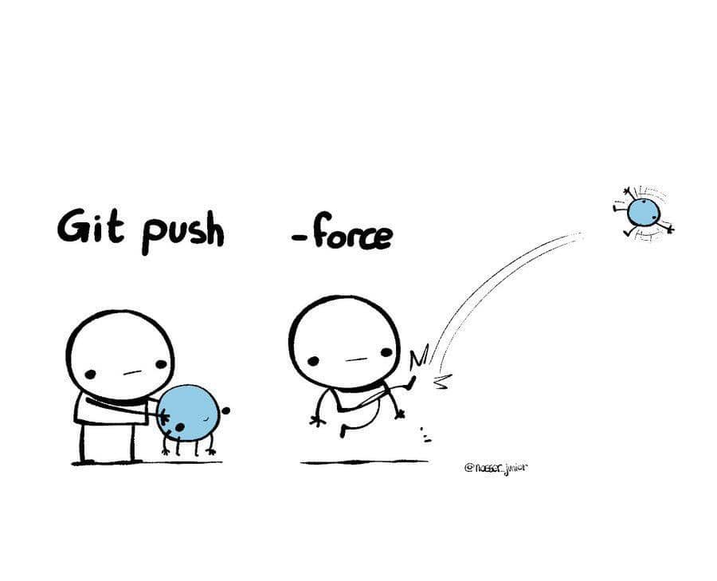

## What is Git?
---
Git is a distributed version control system that allows developers to track changes in their codebase and collaborate with others on the same project. 
It was created by Linus Torvalds in 2005 to manage the development of the Linux kernel, but has since become widely adopted in the software development industry.

With Git, developers can create and store different versions of their code, which can be easily accessed, compared, and merged. This allows developers to work on different features or bug fixes simultaneously, without interfering with each other's work. Git also enables developers to review and revert changes, and to easily roll back to a previous version if needed.

Git works by creating a local repository on a developer's computer, which contains all the code and its history. Changes made to the code are recorded in the local repository, and can be committed and pushed to a remote repository, such as one hosted on a Git hosting service like GitHub, GitLab, or Bitbucket. Other developers can then pull those changes from the remote repository and work on them locally.

Overall, Git provides a powerful and flexible tool for managing software development projects, and is an essential part of modern software development workflows.


## What is Github?
---
GitHub is a web-based platform that provides hosting for software development projects using the Git version control system. It allows developers to store and manage their code repositories, collaborate with others on their projects, and track changes to their code over time.

GitHub provides a number of features to facilitate collaboration among developers. For example, developers can create and merge pull requests, which allow them to review and discuss changes to a codebase before merging them into the main branch. GitHub also provides tools for issue tracking, project management, and code review, which make it easier for developers to work together and stay organized.

GitHub has become an essential tool in the software development industry, with millions of developers and organizations using it to store and manage their code repositories. It has also become a hub for open-source development, with many popular open-source projects hosted on the platform.

In addition to its core features, GitHub also provides a marketplace where developers can find and use tools and services that integrate with the platform, such as continuous integration and deployment tools, code quality analysis tools, and more.


## There is a common misconception among the beginners. They often think that, Git and Github are the same thing. But are they?
---
No, Git and GitHub are not the same thing, although they are often used together in software development workflows.

Git is a distributed version control system that allows developers to track changes to their code over time and collaborate with others on the same project. It is a command-line tool that developers use locally on their computers to manage their code repositories.

GitHub, on the other hand, is a web-based platform that provides hosting for Git repositories. It allows developers to store their code repositories on remote servers and provides tools for collaboration, such as issue tracking, project management, and code review.

In other words, Git is the tool that developers use to manage their code locally, while GitHub is a platform that provides remote hosting for Git repositories and tools for collaboration.

While GitHub is not the only platform that provides hosting for Git repositories (others include GitLab and Bitbucket), it has become one of the most popular and widely used platforms in the software development industry.


## What are the stages involved in moving code changes from local workspace to a remote repository?
---
When working with Git, there are typically three stages involved in moving code changes from your local workspace to a remote repository:

1. Working Directory: The working directory is the local directory on your computer where you make changes to your code.

2. Staging Area: Once you have made changes to your code, you can stage those changes by adding them to the staging area. This is done using the "git add" command, which tells Git to include the changes in the next commit. The staging area is essentially a snapshot of the changes you want to include in the next commit.

3. Committing Changes: After you have staged your changes, you can commit them to the local repository using the "git commit" command. This creates a new snapshot of your code with the changes you have made, along with a commit message describing the changes.

4. Pushing to Remote Repository: Finally, you can push your committed changes to a remote repository (such as one hosted on GitHub) using the "git push" command. This uploads your changes to the remote repository, making them available to other team members who are working on the same project.

In summary, the workflow for moving code changes from your local workspace to a remote repository typically involves making changes to your code in the working directory, staging those changes in the staging area, committing them to the local repository with a commit message, and then pushing those commits to a remote repository.


## How to get started with Git and Github?
---
Basic steps to get started with Git:

1. Install Git: Download and install Git for your operating system. You can find the official Git installer at [git-scm](https://git-scm.com/downloads).

2. Set up Git: Once Git is installed, you should configure your name and email address using the git config command as shown in the previous answer. This will be used to identify the author of your commits.

3. Create a new Git repository: To create a new Git repository, navigate to the directory where you want to create the repository and run the command git init. This initializes an empty Git repository in the current directory.

4. Add files to the repository: After you have initialized a new Git repository, you can add files to it by running the command git add <file> for each file you want to include in the repository. Alternatively, you can use git add . to add all files in the current directory.

5. Commit changes: Once you have added files to the staging area, you can commit them to the repository using the command git commit -m "<commit message>". This creates a new commit containing the changes you have staged, along with a message describing the changes.

6. Push changes to a remote repository: If you want to share your changes with others, you can push them to a remote Git repository such as one hosted on GitHub. To do this, you will need to create a new repository on GitHub and then use the git remote add and git push commands to upload your changes to the remote repository.

7. Branching and Merging: Git allows you to create branches and merge them later. This is useful when you want to work on a new feature or fix a bug without affecting the main branch. You can create a new branch using the git branch <branch-name> command and switch to it using the git checkout <branch-name> command. Once you have made your changes on the new branch, you can merge them back into the main branch using the git merge <branch-name> command.

These are the basic steps to get started with Git. As you become more familiar with Git, you can learn more advanced concepts and workflows to improve your productivity and efficiency.

## How to config Git initially after installing?
---
After installing Git, you should configure your name and email address before using Git for the first time. Here's how you can do it:

1. Open a terminal window or Git Bash (if you're using Windows).

2. Run the following commands, replacing "Your Name" and "your.email@example.com" with your actual name and email address:
```
git config --global user.name "Your Name"
git config --global user.email your.email@example.com
```
These commands will set the user name and email address for your Git account. This information will be included with your Git commits so that other users can see who made the changes.

You can check your configuration settings using the `git config --list` command. This will display a list of all the configuration settings for Git, including the name and email address you just set.

After configuring Git, you can start using it to manage your code repositories. You can create a new repository using the git init command and start tracking changes using the git add and git commit commands. You can also connect to remote repositories and collaborate with other developers using the git clone, git fetch, and git push commands.

## How to create a local Git Repository?
---
To create a local Git repository, you can follow these steps:

1. Open a terminal or command prompt on your computer.

2. Navigate to the directory where you want to create the repository using the cd command. For example, if you want to create the repository in a folder called "my-project", you would run:
```
cd my-project
```
3. Run the command `git init`. This will initialize an empty Git repository in the current directory.

```
git init
```
4. Now you can start adding files (aka __staging__) to your repository using the `git add` command, and commit your changes using the `git commit` command. For example, to add a file called "index.html" to your repository and commit the changes, you would run:
```
git add index.html
git commit -m "Initial commit"
```
That's it! You now have a local Git repository set up on your computer. You can continue to add files, make changes, and commit them to your repository as needed using the git add and git commit commands. You can also use other Git commands to view the history of your changes, create branches, merge changes from other branches, and more.

## How to connect local Git with Github?
---
To login to your Github account in local Git, you'll need to configure Git with your Github credentials. Here's how you can do it:

Open the Git Bash or command prompt on your computer.

Set your Github username using the following command:
```
git config --global user.name "your_github_username"
```
Set your Github email address using the following command:
```
git config --global user.email "your_github_email_address"
```
Generate a personal access token (PAT) on Github. To do this, go to your Github account settings, select "Developer settings" and then "Personal access tokens". Generate a new token with the required permissions (such as repo access) and note down the token.

Set your Github access token as a credential helper using the following command:
```
git config --global credential.helper store
```
Then, run the following command to add your Github access token to the Git credential store:
```
git credential-store --file ~/.git-credentials store
```
This command will open a text editor where you can enter your Github access token in the following format:
```
    protocol=https
    host=github.com
    username=<your_github_username>
    password=<your_github_access_token>
```
Save and close the text editor. Your Github access token is now stored securely in Git.

You should now be able to use Git commands that interact with Github, such as pushing to and pulling from Github repositories, without needing to enter your Github credentials each time.

## How to push local Git Repository to Github?
---
To push a local Git repository to GitHub, you can follow these steps:

1. Create a new repository on GitHub: Log in to your GitHub account and click the "New" button to create a new repository. Give your repository a name and a description, and choose whether it should be public or private. Leave the other settings at their default values.

2. Copy the repository URL: Once you have created the repository on GitHub, copy the repository URL. You can find this by clicking the "Clone or download" button on the repository page and copying the HTTPS URL.

3. Add a remote repository: In your local Git repository, run the following command to add the GitHub repository as a remote:
```
git remote add origin <repository-url>   # Replace <repository-url> with the URL you copied in step 2.
```
4. Push your changes: Finally, you can push your local repository to GitHub using the following command:
```
git push -u origin master
```
This will push your local changes to the remote repository on GitHub. The `-u` option sets the upstream branch for the current branch, so you can use git pull to pull changes from the remote branch in the future.

That's it! Your local Git repository is now pushed to GitHub and can be accessed by other developers or collaborators. You can continue to push changes to the remote repository using the git push command as needed.

   
